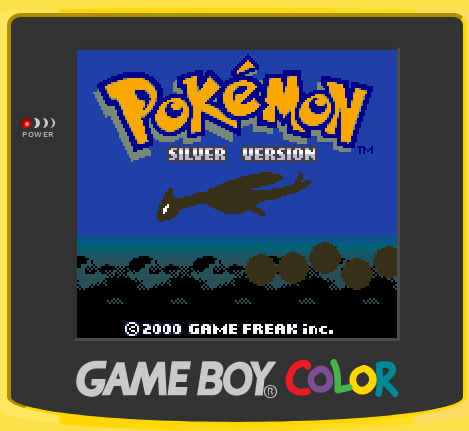

# RustyBoy

A Gameboy/Gameboy color emulator made in Rust, cross compiled to WASM. Also uses with WebGL for rendering.

## Screenshots



## Demo
<a href="http://hkamran.info/projects/rustyboy/">Demo Page</a>

## Requirements

* rustc 1.48.0
* cargo 1.48.0
* npm 6.14.9
* node 14.15.3

## Build 

```sh
1. npm install
2. npm start
```

## Retrospective

* Rust is hard :sweat_drops:
* WASM/RUST cross compiling is so cool. :sparkles:

## Special Thanks

* Blaarg for the CPU tests.
* Imran Nazar for gameboy emulation documentation and test roms.
* mattcurrie for the PPU tests.
* tepples for the input entropy tests.

veil_16871175312
